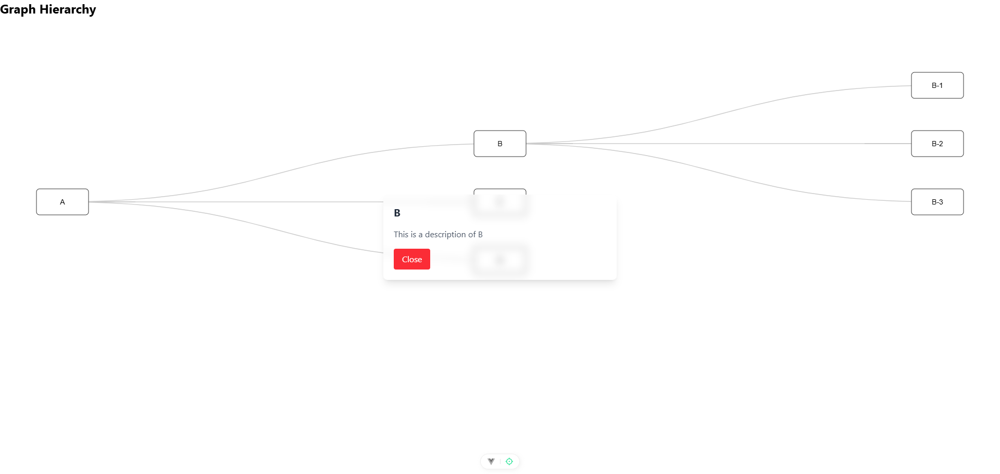

# ABN AMRO Assignment

## Description

A web application built as a technical assignment for ABN AMRO. This project demonstrates modern web development practices and clean code principles, featuring both frontend and backend implementations.

## Application Screenshot



*The application displays an interactive graph hierarchy visualization showing parent-child relationships between nodes, with node details available on click.*


## Technologies Used

### Frontend

- Frontend Framework: Vue3, D3.js
- Styling: Tailwind CSS, Postcss
- Testing: vitest

### Backend

- Runtime: Node.js
- Framework: Express.js
- Database: Neo4j
- Authentication: JWT Bearer token
- Testing: Jest

## Getting Started

### Prerequisites

- Node.js (v18 or higher)
- npm or yarn
- Database Neo4j

### Installation

1. Clone the repository

```bash
git clone https://github.com/szenden/abnamro-assignment
```

2. Install dependencies for both frontend and backend

```bash
# Frontend
cd frontend
npm install

# Backend
cd backend
npm install
```

3. Configure environment variables

```bash
# Backend .env file
PORT=3000
NEO4J_URI=bolt://localhost:7687/neo4j
NEO4J_USER=<your_db_username>
NEO4J_PASSWORD=<your_db_password>
AUTH_TOKEN=<your_secure_token>
CORS_ORIGIN=http://localhost:5173
USE_MOCK_DATA=false

# Frontend .env file
VITE_API_BASE_URL=http://localhost:3000
VITE_API_PATH=api/graph/nodes
VITE_API_TIMEOUT=30000
VITE_AUTH_TOKEN=<your_secure_token>
```

4. Setup the data for store

   #### Use Mock Data

   - Enable the backend .env file USE_MOCK_DATA=true

   #### Neo4j Desktop

   - Install Neo4j Desktop as the graph database
   - Create your database
   - Run scripts (scripts/data_file.txt)

   #### Neo4j Docker

   - Ensure you have [Docker](https://www.docker.com/get-started) installed on your system.
   - Running Neo4j with Docker
   - Pull the Official Neo4j Image
   - Create your database
   - Run scripts (scripts/data_file.txt)

```sh
docker pull neo4j

docker run \
    --name neo4j \
    -p 7474:7474 -p 7687:7687 \
    -e NEO4J_AUTH=neo4j/password \
    -d neo4j
```

5. Start the development servers

```bash
# Backend
cd backend
node src/server.js

# Frontend
cd frontend
npm run dev
```

### Running Tests

```bash
# Backend tests
cd backend
npm test

# Frontend tests
cd frontend
npm run test:unit
```

### Deploy to Azure

The project is configured for automated deployment to Azure using Azure DevOps Pipelines. The deployment process is defined in `azure-ci-pipeline.yml` and consists of three main stages:

1. **Build and Test Stage**

   - Runs frontend and backend tests in parallel
   - Frontend:
     - Installs Node.js 18.x
     - Installs dependencies
     - Runs unit tests
     - Builds the application
   - Backend:
     - Installs Node.js 18.x
     - Installs dependencies
     - Runs tests

2. **Build and Push Containers Stage**

   - Builds Docker containers for both frontend and backend
   - Pushes containers to Azure Container Registry
   - Tags images with:
     - Build ID
     - Latest
     - Dev

3. **Deploy Stage**
   - Only runs on successful merge to main branch
   - Deploys backend container to Azure Web App
   - Deploys frontend container to Azure Web App

To set up deployment:

1. Create an Azure DevOps project
2. Configure Azure Container Registry
3. Update the following variables in azure-ci-pipeline.yml:
   ```yaml
   azureSubscription: "<your-azure-subscription-name>"
   azureContainerRegistry: "<your-azure-container-registry-id>"
   ```
4. Create Azure Web Apps for both frontend and backend
5. Set up the pipeline in Azure DevOps using the azure-ci-pipeline.yml file

The pipeline will automatically trigger on pushes to the main branch.
